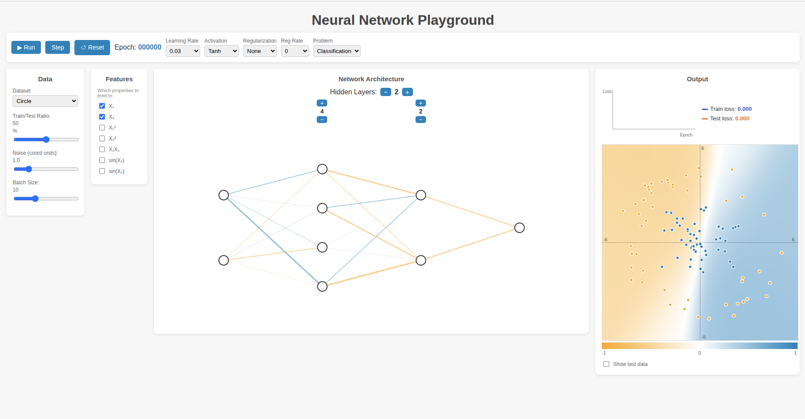
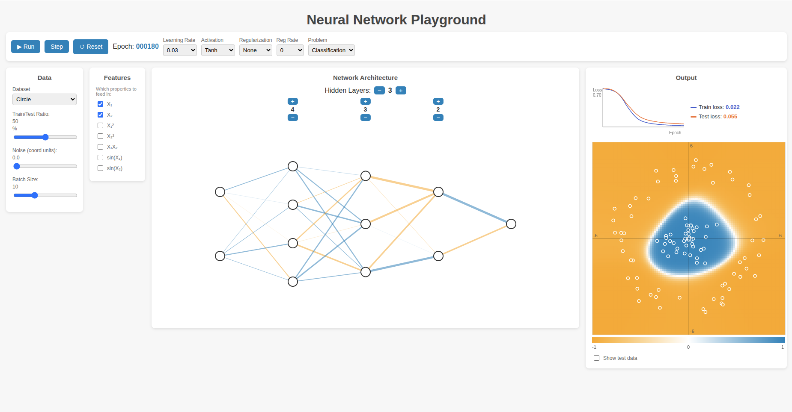

# 🧠 Neural Network Playground

An interactive, browser-based visualization of neural networks for **classification** and **regression** tasks — inspired by [playground.tensorflow.org](https://playground.tensorflow.org/). Built with **TensorFlow.js**, **D3.js**, and **TypeScript**.

Watch a neural network learn in real time: adjust the architecture, tweak hyperparameters, engineer features, and see the decision boundary evolve live.

---

## ✨ Features

- **Live training controls** — Run / Pause / Step buttons with an epoch counter
- **Interactive network builder** — Add/remove hidden layers (up to 15) and neurons per layer (up to 15) with +/− buttons aligned above each layer
- **Feature engineering** — Toggle input features: X₁, X₂, X₁², X₂², X₁X₂, sin(X₁), sin(X₂)
- **Four datasets** — Circle, XOR, Gaussian, Spiral
- **Adjustable data** — Sliders for train/test ratio, noise, and batch size
- **Hyperparameters** — Learning rate, activation (Tanh / ReLU / Sigmoid / Linear), regularization (None / L1 / L2), regularization rate
- **Rich visualization**
  - High-resolution decision-boundary heatmap with X/Y axes
  - Color scale (−1 → white → +1) where **white marks the separation boundary**
  - Live loss chart (train vs. test) with color-coded legend
  - Toggle test-data overlay on/off

---

## 📸 Screenshots

> _Replace these with your own screenshots (see instructions below)._


*Full interface: controls, feature selection, network graph, and output.*


*Network learning the circle dataset.*

---

## 🛠️ Tech Stack

| Purpose | Library |
|---------|---------|
| Neural network engine | [TensorFlow.js](https://www.tensorflow.org/js) |
| Network graph rendering | [D3.js](https://d3js.org/) |
| Heatmap & loss chart | HTML5 Canvas |
| Build tool / dev server | [Vite](https://vitejs.dev/) |
| Language | TypeScript |

---

## 🚀 Getting Started

### Prerequisites

- **Node.js** v18+ (v20 LTS recommended) and **npm**
  ```bash
  node -v   # should print v18+ or v20+
  npm -v
  ```
  If not installed (Ubuntu/Debian):
  ```bash
  curl -fsSL https://deb.nodesource.com/setup_20.x | sudo -E bash -
  sudo apt install -y nodejs
  ```

### Installation

```bash
# 1. Clone the repository
git clone git@github.com:ktanay05/neural-playground.git
cd neural-playground

# 2. Install dependencies
npm install

# 3. Start the development server
npm run dev
```

Then open the URL shown in the terminal (usually **http://localhost:5173/**).

### Build for production

```bash
npm run build      # outputs static files to dist/
npm run preview    # preview the production build locally
```

---

## 🎮 How to Use

| Control | Action |
|---------|--------|
| **▶ Run / ⏸ Pause** | Start or pause continuous training |
| **Step** | Train exactly one epoch |
| **↺ Reset** | Reinitialize the network with fresh weights |
| **Layer + / −** | Add or remove hidden layers |
| **Neuron + / −** (above each layer) | Change neurons in that specific layer |
| **Feature checkboxes** | Choose which input features feed the network |
| **Sliders** | Adjust train/test ratio, noise, batch size |
| **Dropdowns** | Set learning rate, activation, regularization, problem type |
| **Show test data** | Overlay test points (black outline) on the heatmap |

### Quick demo (Spiral)

1. Select the **Spiral** dataset, set noise ≈ **1.0**
2. Enable all features (X₁, X₂, X₁², X₂², X₁X₂, sin(X₁), sin(X₂))
3. Build a network like `[8, 8, 6]`
4. Learning rate **0.03**, activation **Tanh**
5. Click **▶ Run** and watch the spiral boundary form

---

## 📁 Project Structure

```
neural-playground/
├── index.html              # UI layout
├── package.json            # Dependencies & scripts
├── src/
│   ├── main.ts             # App logic, controls, training loop
│   ├── style.css           # Styling
│   ├── network/
│   │   ├── dataset.ts      # Dataset generators (circle, xor, gaussian, spiral)
│   │   ├── features.ts     # Feature engineering definitions
│   │   └── model.ts        # TensorFlow.js model builder & training
│   └── viz/
│       ├── heatmap.ts      # Decision-boundary heatmap + color scale
│       ├── lossChart.ts    # Train/test loss line chart
│       └── networkGraph.ts # D3 network node/edge rendering
└── README.md
```

---

## 🧩 How It Works

1. **Data generation** — Synthetic 2D points are created for the chosen dataset and split into train/test sets.
2. **Feature transform** — Selected features (e.g., X₁², sin(X₁)) expand each point into an input vector.
3. **Model** — A `tf.Sequential` model is built from your layer/neuron/activation choices and compiled with SGD.
4. **Training** — Each epoch calls `model.fit(...)`; loss is recorded for train and test sets.
5. **Visualization** — After each epoch the app predicts over a dense grid to draw the decision boundary, updates edge colors/thickness from weights, and appends to the loss chart.

---

## 🤝 Contributing

Contributions are welcome! Feel free to open an issue or submit a pull request.

## 📄 License

Released under the **MIT License**. See [LICENSE](LICENSE) for details.

## 🙏 Acknowledgments

Inspired by Google's [TensorFlow Playground](https://playground.tensorflow.org/).
